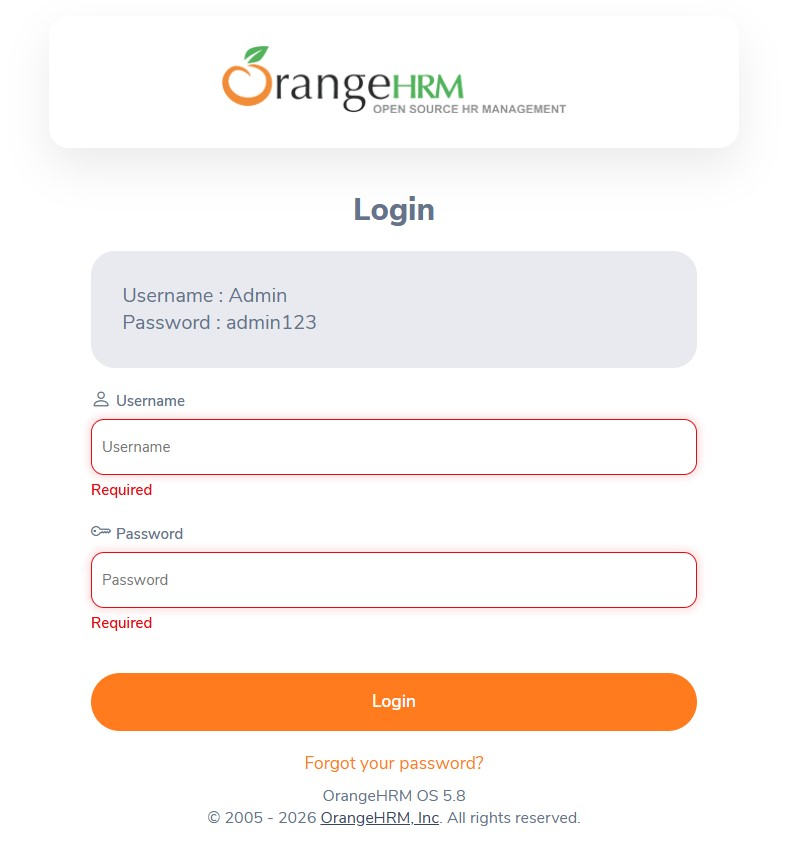
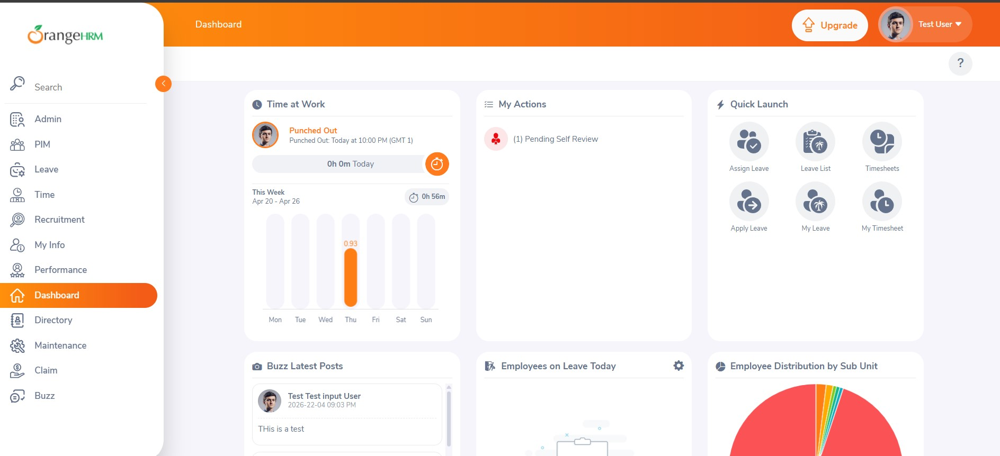
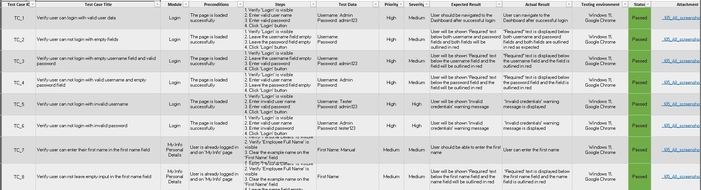
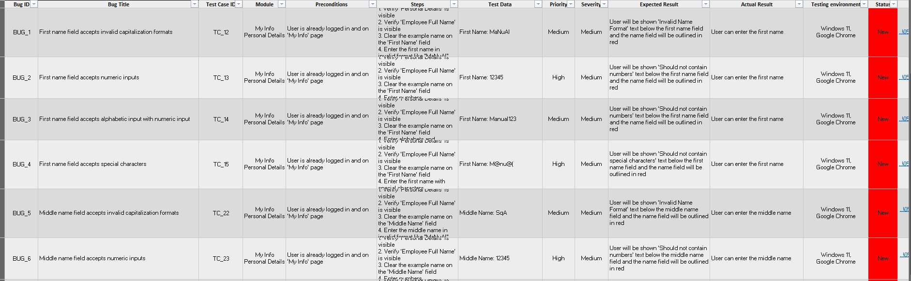
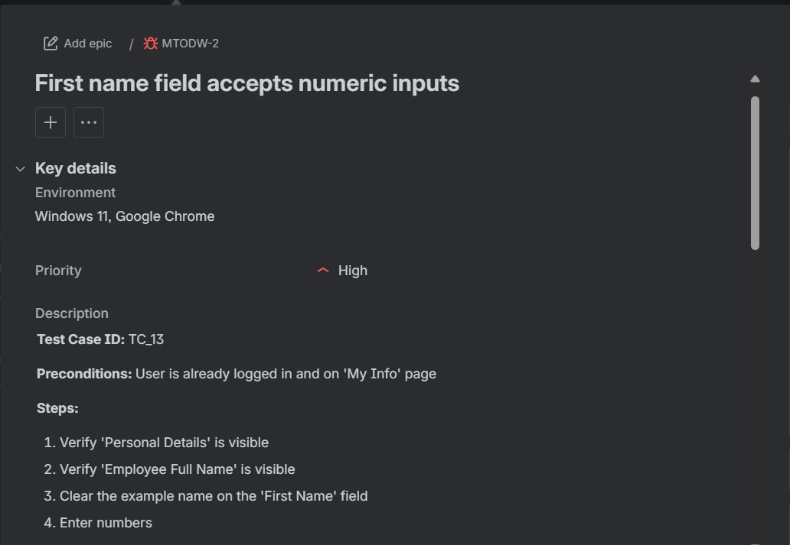
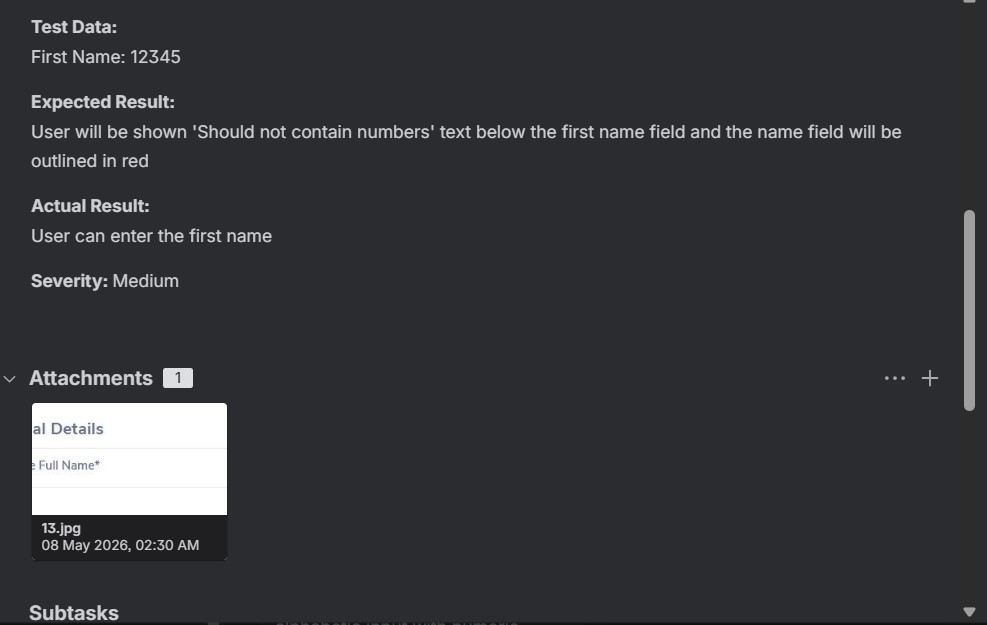
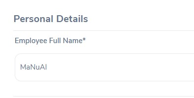
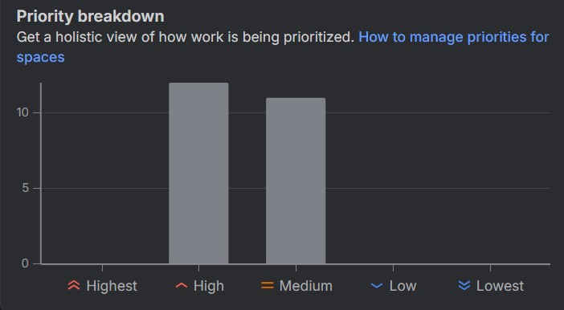

# Manual-Testing---OrangeHRM-Demo-Website

This repository contains a complete **Manual Testing** project conducted on the **OrangeHRM Demo Website**. The project demonstrates the end-to-end software testing process, including test planning, test case design, test execution, defect reporting and test summary documentation.
The objective of this project is to verify the functionality of the application, identify defects and ensure that the tested modules meet the expected business requirements.

---

## Project Objectives

- Understand the application's functionality and business requirements.
- Prepare a comprehensive Test Plan.
- Design and execute manual test cases.
- Identify and document software defects.
- Prepare a Test Summary Report.
- Demonstrate practical knowledge of the Software Testing Life Cycle (STLC).

---

## Application Under Test

**Application Name:** OrangeHRM Demo 

**Application Type:** Human Resource Management System (HRMS)

**Testing Type:** Manual Testing 

**Test Environment:** Web Application 

**Website:** https://opensource-demo.orangehrmlive.com/ 


---

## Scope

The following modules were tested:
- Login
- My Info

---

## Testing Types Performed

- Functional Testing
- UI Testing
- Positive Testing
- Negative Testing
- Smoke Testing

---

## Tools Used

- Microsoft Excel
- GitHub
- Jira

---

## Project Deliverables

- Test Plan
- Test Cases
- Bug Reports
- Test Summary Report
- Screenshots

---

## Repository Structure

```text
Manual-Testing---OrangeHRM-Demo-Website

├── Test Plan
│   └── Test Plan.xlsx
│
├── Test Cases
│   └── Test Cases.xlsx
│
├── Bug Reports
│   ├── Bug Report.xlsx
│   └── Jira Bug Report.pdf
│
├── Test Summary
│   └── Test Summary Report.pdf
│
├── Screenshots
│   └── All Testing Screenshots
│
└── README.md
```

---

## Test Metrics

| Metric | Count |
|---------|------:|
| Modules Tested | 2 |
| Test Cases | 69 |
| Executed Test Cases | 69 |
| Passed | 46 |
| Failed | 23 |
| Bugs Reported | 23 |

---

## Defect Reporting

All identified defects were documented with:

- Bug ID
- Bug Title
- Steps to Reproduce
- Expected Result
- Actual Result
- Severity
- Priority
- Status
- Supporting Screenshots

Defects were also tracked using **Jira** to demonstrate defect management practices.

---

## Project Screenshots

### Login Page



### Dashboard



### Test Cases



### Bug Report




**Bug Report on JIRA**




**Bug Evidence**



**Bug Summary on JIRA**



---

## Skills Demonstrated

- Requirement Analysis
- Test Planning
- Test Scenario Design
- Test Case Writing
- Manual Test Execution
- Functional Testing
- UI Testing
- Positive & Negative Testing
- Smoke Testing
- Bug Reporting
- Jira Defect Tracking
- Test Documentation
- GitHub Version Control

---

## Test Summary

The OrangeHRM Demo Website was manually tested based on the defined test scope. Test cases were executed successfully and multiple functional defects were identified and documented.
The project demonstrates practical knowledge of manual software testing, structured test documentation and defect reporting following industry-standard QA practices.

---

## Author

**Humayra Siddika**  

Aspiring Software Quality Assurance (SQA) Engineer

GitHub: https://github.com/humayrasiddika22 

LinkedIn: https://linkedin.com/in/humayra-siddika/ 

---
